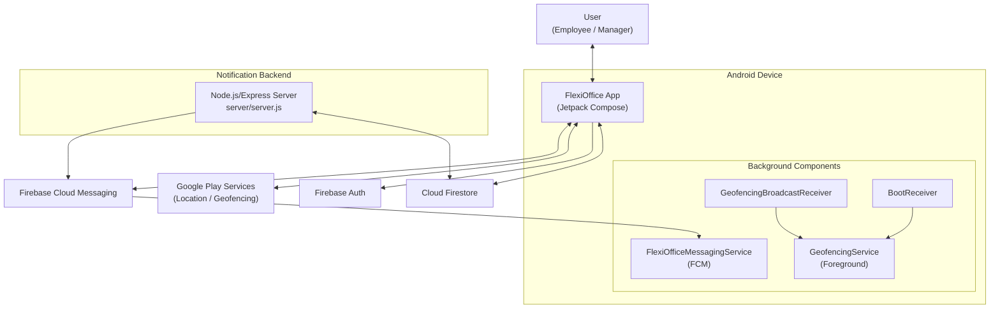
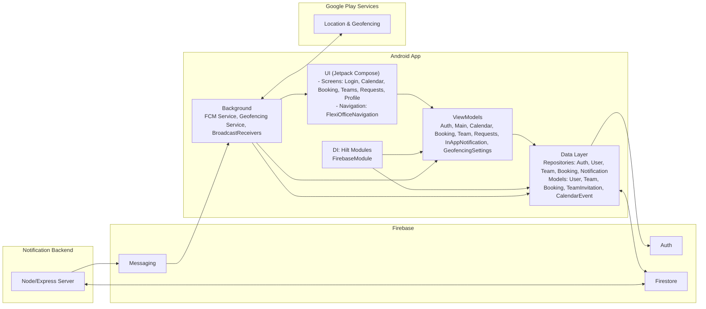
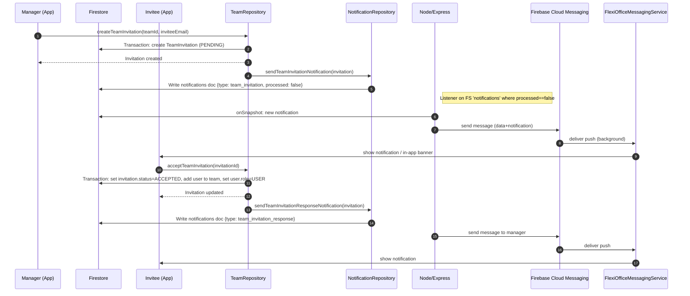
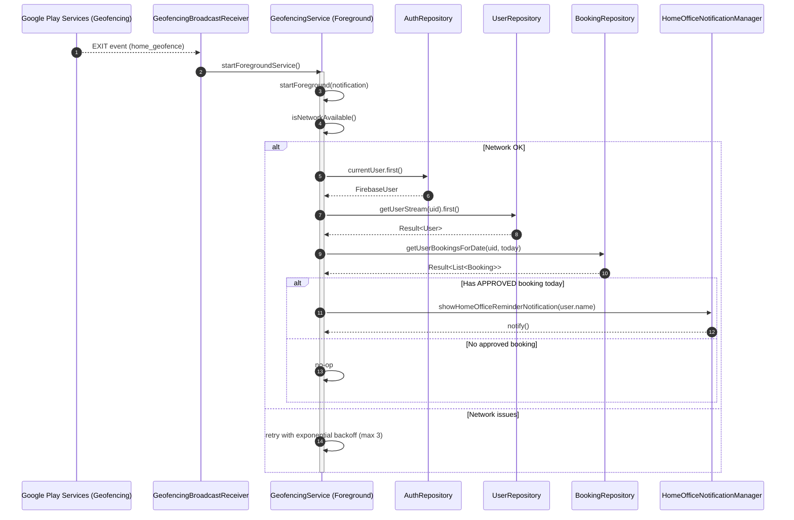
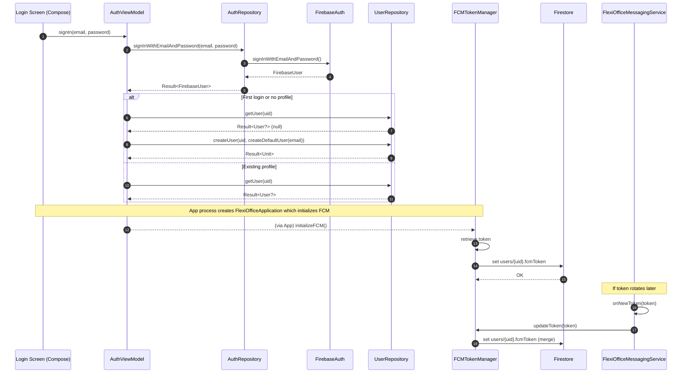
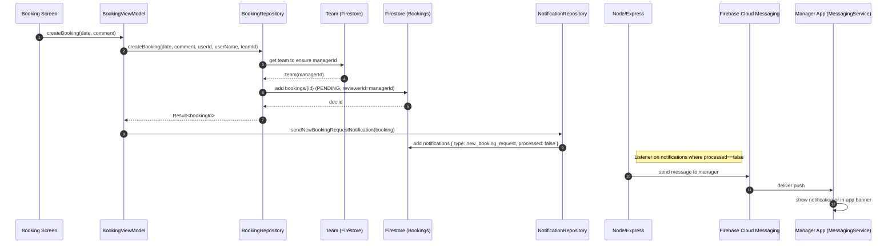
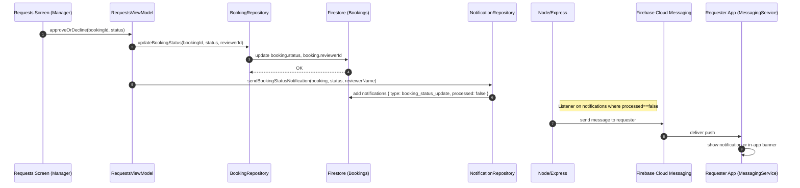

# FlexiOffice Architecture Overview

This document provides a concise overview of the FlexiOffice app architecture and key flows. Diagrams are in Mermaid format for readability in GitHub.

## System Context

## Containers & Components

## Key Sequences

### 1) Team invitation acceptance

### 2) Geofence exit -> home-office reminder

### 3) User login and FCM token registration

### 4) Create booking and notify manager

### 5) Approve/decline booking and notify requester

## Technology choices

- UI: Jetpack Compose, Material3, Navigation Compose
- DI: Hilt (FirebaseModule provides Auth, Firestore, Messaging)
- Data: Repositories wrapping Firebase Auth/Firestore; Flows for realtime updates
- Notifications: FCM push via Firestore-triggered Node server; In-app banner or system notifications
- Background: Geofencing (Google Play Services), ForegroundService for checks, Boot receiver for re-registration
- Testing/Coverage: JUnit, MockK, Turbine, Jacoco, Ktlint

## Packages at a glance

- `presentation/` — ViewModels and Compose screens/components
- `data/` — Repositories and models for Auth, User, Team, Booking, Notification
- `fcm/` — FCM service and token management
- `geofencing/` — Manager, Service, permissions, and notifications
- `broadCastReceiver/` — Geofence and boot receivers
- `di/` — Hilt modules
- `navigation/` — Routes and navigation graph
- `util/` — Utilities (Logger, ShakeDetector)

## Notes

- Team membership is enforced via invitations; acceptance updates user.role and team.members atomically.
- The Node server polls Firestore 'notifications' (processed=false) to dispatch FCM reliably.
- Geofencing uses enter+exit to stabilize state; service uses retry with backoff and keeps a daily notification guard.
